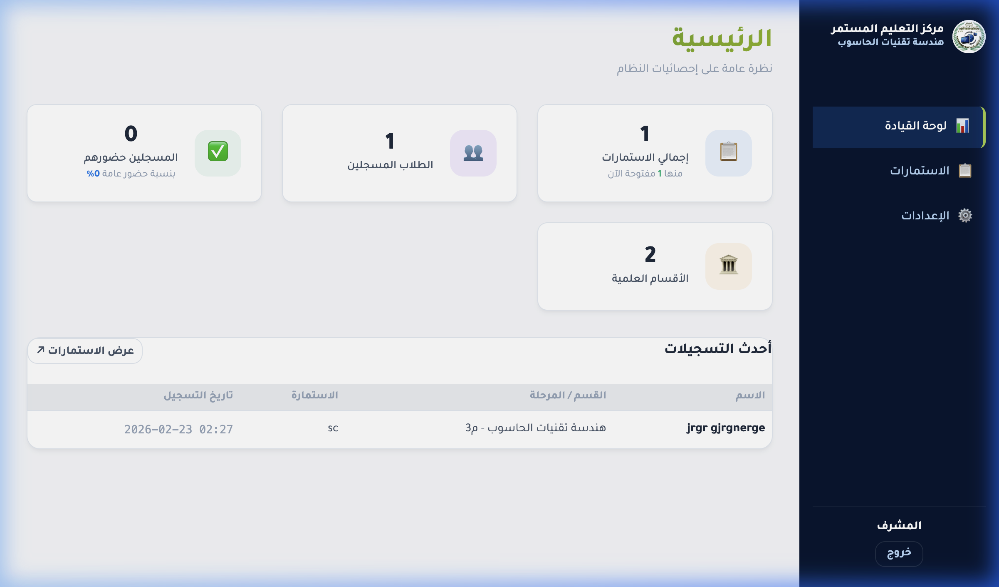
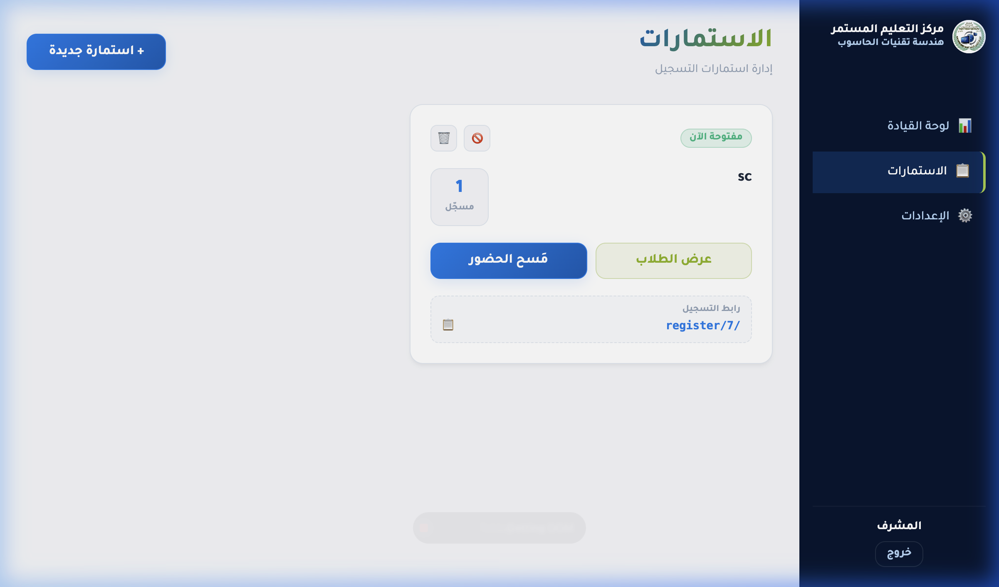
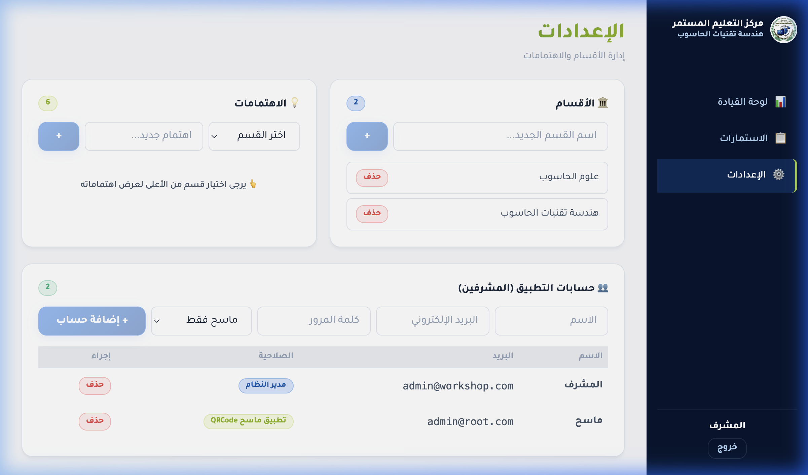
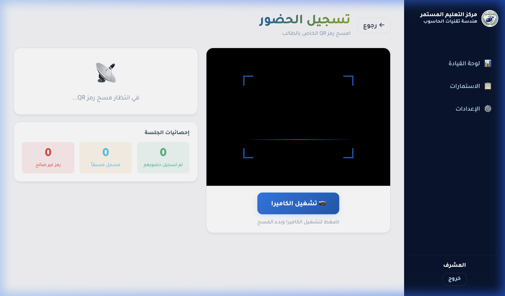

# نظام تسجيل ورش العمل — مركز التعليم المستمر

نظام ويب متكامل لإدارة تسجيل طلاب الورش التدريبية في مركز التعليم المستمر / هندسة تقنيات الحاسوب.

---

## ✨ المميزات

- **لوحة إحصائيات رئيسية** — عرض إجمالي الطلاب، الاستمارات، نسبة الحضور، وأحدث التسجيلات
- **إدارة الاستمارات** — إنشاء وتعديل وحذف استمارات التسجيل بسهولة
- **تسجيل الطلاب** — نماذج عامة للتسجيل بدون الحاجة لتسجيل دخول
- **مسح الحضور بـ QR Code** — تسجيل حضور الطلاب عبر مسح رمز QR لكل طالب
- **تصدير بيانات Excel** — تنزيل قائمة الطلاب وبيانات الحضور بصيغة `.xlsx`
- **إدارة المستخدمين (RBAC)** — صلاحيتان: **مدير النظام** و **ماسح فقط**
- **إعدادات النظام** — إدارة الأقسام والاهتمامات وحسابات المشرفين

---

## 🛠️ التقنيات المستخدمة

### الواجهة الأمامية (Frontend)
| التقنية | الوصف |
|---|---|
| **Vue.js 3** | إطار عمل JavaScript لبناء واجهة المستخدم |
| **Vite** | أداة build سريعة للمشاريع الحديثة |
| **Vue Router** | إدارة التنقل بين صفحات التطبيق |
| **Axios** | إرسال طلبات HTTP للتواصل مع الـ API |
| **QRCode.js** | توليد رموز QR لكل طالب مسجل |
| **jsQR** | مسح وقراءة رموز QR عبر الكاميرا |
| **SheetJS (xlsx)** | تصدير بيانات الطلاب إلى ملفات Excel |

### الواجهة الخلفية (Backend)
| التقنية | الوصف |
|---|---|
| **Laravel 11** | إطار عمل PHP لبناء الـ API |
| **Laravel Sanctum** | نظام المصادقة (Authentication) |
| **MySQL** | قاعدة البيانات |
| **Eloquent ORM** | التعامل مع قاعدة البيانات |

---

## 🚀 تشغيل المشروع محلياً

```bash
# Backend
cd backend
composer install
cp .env.example .env
php artisan key:generate
php artisan migrate --seed
php artisan serve

# Frontend (في terminal منفصل)
cd frontend
npm install
npm run dev
```

بيانات الدخول الافتراضية:
- **البريد:** `admin@workshop.com`
- **الرقم السري:** `admin123`

---

## 🌐 النشر على Plesk (Deployment)

### خطوات النشر بعد رفع الملفات:

#### 1. تثبيت المتطلبات
```bash
composer install --optimize-autoloader --no-dev
```

#### 2. إعداد ملف البيئة
```bash
cp .env.example .env
```
ثم عدّل ملف `.env` وأضف:
```env
APP_ENV=production
APP_KEY=
APP_URL=https://yourdomain.com
DB_CONNECTION=mysql
DB_HOST=127.0.0.1
DB_PORT=3306
DB_DATABASE=اسم_قاعدة_البيانات
DB_USERNAME=اسم_المستخدم
DB_PASSWORD=كلمة_المرور
```

#### 3. توليد مفتاح التطبيق
```bash
php artisan key:generate
```

#### 4. بناء جداول قاعدة البيانات وإضافة البيانات الأولية
```bash
php artisan migrate --seed --force
```

#### 5. ربط مجلد التخزين
```bash
php artisan storage:link
```

#### 6. تحسين الأداء (كاش)
```bash
php artisan config:cache
php artisan route:cache
php artisan view:cache
```

> **ملاحظة Plesk:** تأكد من أن `Document Root` يشير إلى مجلد `public` وأن الـ `.htaccess` مفعّل (AllowOverride All).

---

## 📸 لقطات من النظام

### لوحة القيادة


### إدارة الاستمارات


### الإعدادات وإدارة المستخدمين


### تسجيل الحضور بـ QR Code


---

## 📄 الترخيص

هذا المشروع مطوّر لأغراض أكاديمية — مركز التعليم المستمر، كلية هندسة تقنيات الحاسوب.
